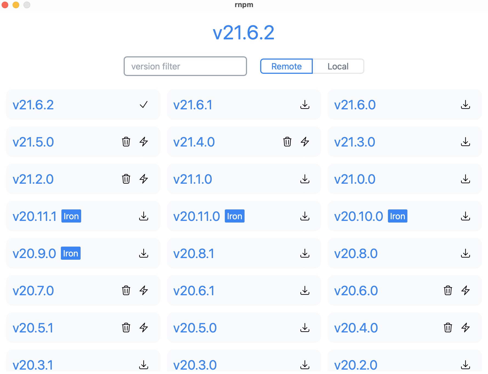

# Rust Node Version Management

Cross-platform node version management tool developed using Rust, Tauri, and Leptos



## How to use

```shell
cargo install tauri-cli  
cargo install trunk   
git clone https://github.com/ES1993/rnpm.git
cd rnpm
cargo tauri build
```

## Problam

if show damaged

```shell
xattr -cr /Applications/rnpm.app/
```